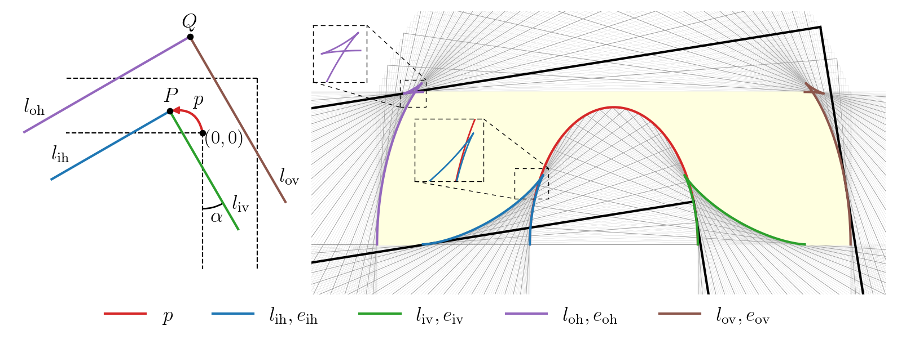

# Moving Sofa with neural networks

This repository provides code and experiments for the following paper:

**K Leng, J Bi, J Cha, S Pinilla, J Thiyagalingam, 2024.
Deep Learning Evidence for Global Optimality of Gerver's Sofa. arxiv link pending.**

**Abstract**  
The Moving Sofa Problem, formally proposed by Leo Moser in 1966, seeks to determine the largest area of a two-dimensional shape that can navigate through an L-shaped corridor with unit width. The current best lower bound is about 2.2195, achieved by Joseph Gerver in 1992, though its global optimality remains unproven. In this paper, we investigate this problem by leveraging the universal approximation strength and computational efficiency of neural networks. We report two approaches, both supporting Gerver's conjecture that his shape is the unique global maximum. Our first approach is continuous function learning. We drop Gerver's assumptions that i) the rotation of the corridor is monotonic and symmetric and, ii) the trajectory of its corner as a function of rotation is continuously differentiable. We parameterize rotation and trajectory by independent piecewise linear neural networks (with input being some pseudo time), allowing for rich movements such as backward rotation and pure translation. We then compute the sofa area as a differentiable function of rotation and trajectory using our "waterfall" algorithm. Our final loss function includes differential terms and initial conditions, leveraging the principles of physics-informed machine learning. Under such settings, extensive training starting from diverse function initialization and hyperparameters are conducted, unexceptionally showing rapid convergence to Gerver's solution. Our second approach is via discrete optimization of the Kallus-Romik upper bound, which converges to the maximum sofa area from above as the number of rotation angles increases. We uplift this number to 10000 to reveal its asymptotic behavior. It turns out that the upper bound yielded by our models does converge to Gerver's area (within an error of 0.01% when the number of angles reaches 2100). We also improve their five-angle upper bound from 2.37 to 2.3337.

## Installation
`PyTorch` is the only requirement for this repository.

## Training
To train a physics-informed neural network to detect a sofa shape by optimizing its area, 
which corresponds to Section 2 of the paper, use 

```python
python train_pinn.py --help
```

The default arguments are good enough to land on Gerver's sofa.

To train a neural network to find a Kallus-Romik upper bound, which corresponds to Section 3 of the paper, use

```python
python train_upper.py --help
```

Script `train_upper_eq26_29.sh` considers the seven-angle case presented in Eq. 26~29 of Kallus & Romik (2018), 
corresponding to Section 3.2 of our paper. 
Script `train_upper_eq15.py` computes Eq. 15 of Kallus & Romik (2018), showing the asymptotic convergence of 
their upper bound to Gerver's solution, corresponding to Section 3.3 of our paper.

Notebook `paper.ipynb` generates all the figures shown in the paper.

## Visualization

The `compute_area()` function from both `pinn.geometry` and `upper.geometry` will return all the geometric objects
resulting from the inputs (which define a movement of the corridor). For example, the third cell in `paper.ipynb` 
define an elliptical path of the inner corner by 

```python
xp = a * (torch.cos(2 * alpha) - 1)
yp = b * torch.sin(2 * alpha)
```

The geometric objects are obtained by 
```python
gg = compute_area(t, alpha, xp, yp, dt_alpha, dt_xp, dt_yp, return_geometry=True)
```

The following figure is then generated by plotting the objects contained in `gg`.



## Acknowledgments
This work is supported by the EPSRC grant, Blueprinting for AI for Science at Exascale (BASE-II, EP/X019918/1). 